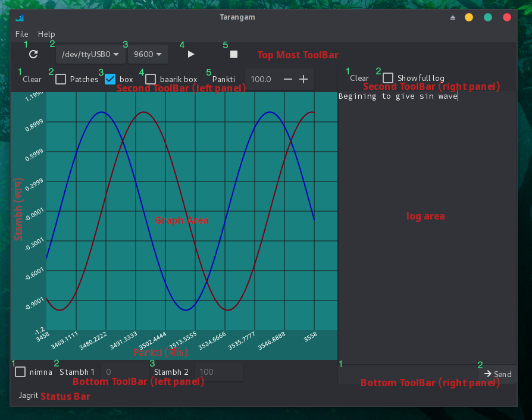
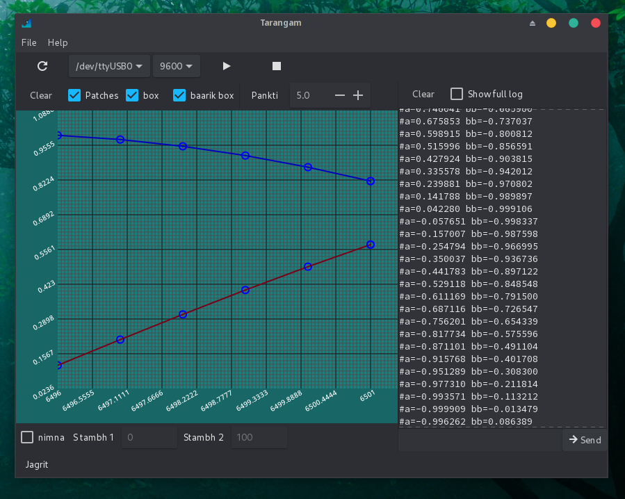
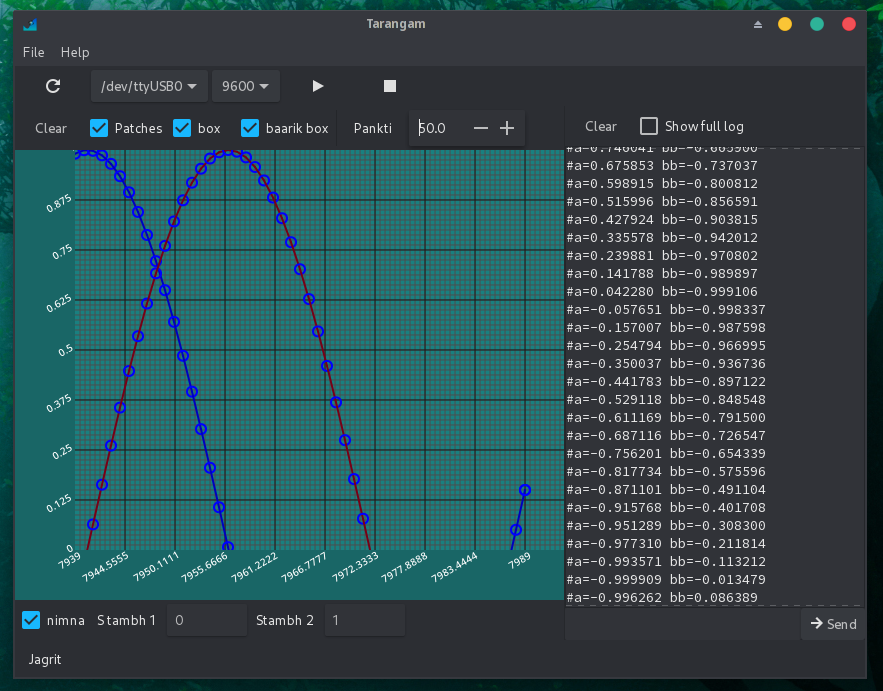

# Tarangam

It is a simple application to see log from [serialports](https://wiki.osdev.org/Serial_Ports) and plot information on graph. You can use it with IOT boards([ardino](https://www.arduino.cc/), [esp boards](https://www.espressif.com/),...) in you DIY projects. It gives to many basic controls to control graph.

## Interface


### Top Most ToolBar
1. Button with refresh icon is to reload list of ports.
2. Select Port
3. Select Baudrate
4. Start
5. Stop

### Second ToolBar (left panel)
1. Clear Graph
2. Show small circles over the points where values lies
3. Show larger boxes
4. Baarik Box, show small boxes which make it look like graph paper
5. Pankti is number of values to show in y axis

### Second ToolBar (right panel)
1. Clear Log
2. Show full log which include points to draw on graph

### Bottom ToolBar (left panel)
1. Nimna is to use custom value of y axis
2. Stambh1 is lower point on y
3. Stambh2 is higher point on y

### Bottom ToolBar (right panel)
1. Send Text (You can press enter to send text)
2. Send Button





## Instruction to connect your IOT board
1. Connect the IOT board through USB
2. Click Refresh button in Top Most ToolBar
3. Select your Port and baudrate
4. Press Start button

## Status of Serial port
|State     |Meaning                      |
|----------|-----------------------------|
|JAGRIT    |Mode of Active               |
|SAYAN     |Mode of Sleeping             |
|AVRODTIH  |Mode of being stopped        |
|PARIVARTIT|Mode of being values modified|

## Rules of text to Draw on graph
1. Each line in the text should start with #
2. You can write as foo=value or just values with space

#### Example

``` #s=1 b=2 ```

```#1 5 4```


# LICENSE
This program is free software: you can redistribute it and/or modify
it under the terms of the GNU General Public License as published by
the Free Software Foundation, either version 3 of the License, or
at your option) any later version.

This program is distributed in the hope that it will be useful,
but WITHOUT ANY WARRANTY; without even the implied warranty of
MERCHANTABILITY or FITNESS FOR A PARTICULAR PURPOSE.  See the
GNU General Public License for more details.

You should have received a copy of the GNU General Public License
along with this program.  If not, see <https://www.gnu.org/licenses/>.

